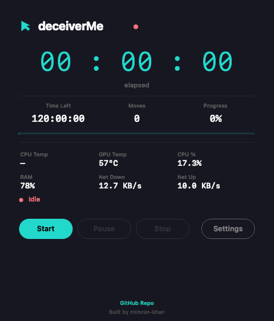
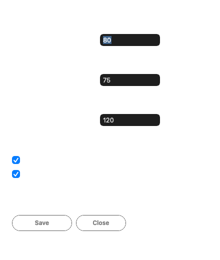

<div align="center">

# deceiverMe

[](LICENSE)
[](https://developer.apple.com/macos/)
[](https://swift.org)

**Native macOS menu bar app — timed cursor movement, sessions, system monitoring, and idle prevention.**

[Overview](#overview) · [Screenshots](#screenshots) · [Features](#features) · [User Guide](#user-guide) · [Build](#build) · [Reference](#reference) · [Troubleshooting](#troubleshooting)

<br/>

</div>

## Screenshots

<p align="center">
  
  &nbsp;&nbsp;&nbsp;
  
</p>

---

## Overview

deceiverMe moves the cursor on a schedule (configurable pixels, direction, and interval). Use it for **demos**, **long sessions**, or **keeping the display and system from idling** — only on **machines you own or are allowed to control**.

| | |
| :--- | :--- |
| **Bundle** | `deceiverMe.app` |
| **Executable** | `MouseMoverNative` |
| **Bundle ID** | `com.deceiverme.app` |
| **Source** | Single Swift file + `packaging/Info.plist` |
| **Build** | `./build.sh` → universal binary, ad-hoc codesign, optional zip |
| **Repo** | [github.com/mimran-khan/deceiverme](https://github.com/mimran-khan/deceiverme) |
| **Author** | [mimran-khan](https://mimran-khan.github.io/) |

---

## Features

### Cursor movement

- **Pixels per move** — configurable step size (default `5`)
- **Direction** — right, left, up, down, or **circular** (small circular step)
- **Interval** — seconds between moves (default `10`)
- Uses **CoreGraphics** (`CGEvent` / `.cghidEventTap`); cursor is clamped inside the **main display** with a margin

### Sessions

| Mode | Behavior |
| :--- | :--- |
| **Run forever** | Runs until you stop |
| **Fixed duration** | Stops after **N hours** of **active** time (paused time does not count) |
| **Stop at date & time** | Stops when the system clock passes the chosen moment |

**Menu presets** (one-shot; override saved defaults): saved settings, run forever, 1 h / 4 h / 8 h.

### Dashboard

Title: **deceiverMe**. Main areas:

| Element | Description |
| :--- | :--- |
| Status badge | `Idle` / `Running` / `Paused` |
| Clock | Session elapsed `HH:MM:SS` |
| Time left | Remaining time, `∞` if open-ended |
| Moves | Move count |
| Progress | Progress bar (or `—` if no end) |
| System monitor | CPU/GPU temperature, CPU %, RAM, network throughput |
| Buttons | **Start**, **Pause** / **Resume**, **Stop**, **Settings** |

**Start** is only enabled when fully idle.

### System monitor

Real-time system telemetry displayed in the Dashboard and the menu bar:

| Metric | Source |
| :--- | :--- |
| CPU temperature | SMC (Apple Silicon & Intel) |
| GPU temperature | SMC |
| CPU usage | `host_processor_info` |
| RAM usage | `host_statistics64` |
| Network throughput | `getifaddrs` (down / up) |

Temperature readings use a persistent SMC connection via IOKit for stability.

### Menu bar

- **Icon** — concentric rings (template image)
- **Status** — may show elapsed time; paused shows `Paused` status
- **Start** — submenu with presets (saved settings, run forever, 1h / 4h / 8h)
- **Pause** / **Resume**, **Stop**
- System stats (CPU, RAM, network, temperatures)
- **Dashboard** — `⌘W`
- **Settings…** — `⌘,`
- **Quit** — `⌘Q`

### Settings

**Settings — deceiverMe**

| Control | Purpose |
| :--- | :--- |
| Pixels, Direction, Interval | Movement configuration |
| Session mode | Run forever / Fixed duration / Stop at date & time |
| Duration (hours) | For fixed duration mode |
| Stop at | Date-time picker for scheduled stop |
| Notify when session ends | End notification toggle |
| Keep display & system awake | `ProcessInfo.beginActivity` with idle display + system sleep disabled while running |
| Global shortcut | Display + **Record shortcut…** |
| Save / Close | Persist settings or dismiss |

Saving is **blocked while a session is running** (shows an alert).

### Global hotkey

Carbon **RegisterEventHotKey**. Default **`⌘⇧Space`**: idle → start with saved settings; running → pause toggle.

### Notifications

**UserNotifications**: title `Session ended`, subtitle `deceiverMe`, body = reason. Banners on macOS 11+.

### URL scheme

Scheme: **`deceiverme`**

| URL | Action |
| :--- | :--- |
| `deceiverme://start` | Start (saved settings) |
| `deceiverme://start?duration=3600` | Start, 3600 s session |
| `deceiverme://start?until=<unix>` | Start, stop at Unix epoch seconds |
| `deceiverme://stop` | Stop |
| `deceiverme://pause` or `toggle` | Start if idle, else pause toggle |

```bash
open "deceiverme://start?duration=1800"
open "deceiverme://stop"
```

---

## User Guide

1. **Build or install** `deceiverMe.app` (see [Build](#build)).
2. **Open** the app — menu bar icon appears; Dashboard can stay open.
3. **Grant Accessibility** when prompted (System Settings → Privacy & Security → Accessibility).
4. Open **Settings…** (pixels, direction, interval, session mode, options) → **Save**.
5. **Start** from the Dashboard or **Start** menu (or hotkey / URL).
6. Use **Pause** / **Resume** and **Stop** as needed.

---

## Build

### Requirements

- macOS with **Xcode Command Line Tools**
  `xcode-select --install`

### Command

```bash
chmod +x build.sh   # first time only
./build.sh
```

The script:

1. Validates `MouseMoverNative/MouseMoverNative.swift` and `packaging/Info.plist`
2. Copies `Info.plist`, writes `PkgInfo`
3. Compiles with **`-O -whole-module-optimization`** for both slices (universal) or one arch (native)
4. Links frameworks: Cocoa, CoreGraphics, Carbon, UserNotifications, **IOKit**
5. Runs **`lipo`** when building universal (Intel + Apple Silicon, macOS 11+)
6. Ensures the executable exists and is non-empty
7. **`codesign --force --deep --sign -`** and **`codesign --verify`** (unless skipped)
8. Creates **`dist/deceiverMe-macos.zip`** with **`ditto`** (unless skipped)

### Outputs

```
deceiverMe.app/          ← at repository root (gitignored)
dist/deceiverMe-macos.zip
```

### Environment variables

| Variable | Effect |
| :--- | :--- |
| `BUILD_STYLE=native` | Single-arch for current CPU only |
| `SKIP_CODESIGN=1` | No codesign |
| `SKIP_ZIP=1` | No zip |

```bash
BUILD_STYLE=native ./build.sh
SKIP_ZIP=1 ./build.sh
```

**Native plist minimum:** `x86_64` → 10.13, `arm64` → 11.0 (script patches `LSMinimumSystemVersion`).

> `deceiverMe.app/` and `dist/` are listed in `.gitignore`.

---

## Reference

### How it runs (technical)

1. `NSApplication` + `NSStatusItem` + Dashboard `NSWindow`
2. `Timer` (on `RunLoop.main`, `.common` mode) every `moveInterval` → `moveMouse()`
3. `AXIsProcessTrustedWithOptions` before first start
4. `shouldAutoStop` on tick → optional `stopMovement(notify:reason:)`
5. 1 Hz UI refresh for menu + Dashboard
6. SMC temperature polling via persistent IOKit connection

### UserDefaults keys

| Key | Meaning |
| :--- | :--- |
| `pixelMove` | Pixels per move |
| `direction` | `MovementDirection` raw value |
| `moveInterval` | Interval (seconds) |
| `totalDuration` | Duration (seconds) |
| `prefsSessionKind` | `0` run forever / `1` fixed duration / `2` stop at |
| `sessionUntilEpoch` | Deadline (`timeIntervalSince1970`) |
| `notifyOnSessionEnd` | Bool (default true if missing) |
| `preventIdleSleepWhileRunning` | Bool (default **true** if key missing) |
| `hotkeyKeyCode` | Carbon virtual key |
| `hotkeyCarbonModifiers` | Carbon modifiers bitmask |

### Repository layout

```
.
├── LICENSE
├── README.md
├── AGENTS.md
├── build.sh
├── .gitignore
├── packaging/
│   └── Info.plist
└── MouseMoverNative/
    └── MouseMoverNative.swift
```

---

## Permissions

**Accessibility** — required for cursor control.

`System Settings` → `Privacy & Security` → `Accessibility` → enable **deceiverMe** (or **MouseMoverNative** if listed).

Restart the app after changes.

**Notifications** — optional; allow if you want session-end alerts.

---

## Troubleshooting

| Issue | What to do |
| :--- | :--- |
| Build fails at **swiftc** | Install CLT; check Swift errors in the terminal |
| **codesign** fails | Read the printed error; or `SKIP_CODESIGN=1 ./build.sh` for local-only |
| Zip missing | Ensure `SKIP_ZIP` is not set; check `dist/` is writable |
| App won't open | Right-click → Open; review Gatekeeper / quarantine |
| Cursor never moves | Accessibility off → add app and restart |
| Hotkey not working | Pick another combo in **Record shortcut…** |
| Can't save settings | Stop the session first |
| Screen still locks | Leave **Keep display & system awake** on in Settings; confirm a running session (not paused). **MDM** or **Lock Screen after …** policies can still force lock. |
| Temperatures show `—` | SMC access may require running without sandboxing; ad-hoc signed builds work on personal machines |

---

## Security and ethics

- No bundled **network** or telemetry — no data leaves your machine.
- Cursor control and idle-sleep assertions are **sensitive** in managed environments — follow **policy**.
- **Ad-hoc** sign is fine for personal builds; wide distribution usually needs **Developer ID** + **notarization**.

---

## Contributing

Issues and PRs welcome at [github.com/mimran-khan/deceiverme](https://github.com/mimran-khan/deceiverme). Run `./build.sh` successfully before submitting Swift changes.

---

## License

[MIT](LICENSE) © 2026 deceiverMe contributors.

---

<div align="center">

Built by [mimran-khan](https://mimran-khan.github.io/)

</div>
